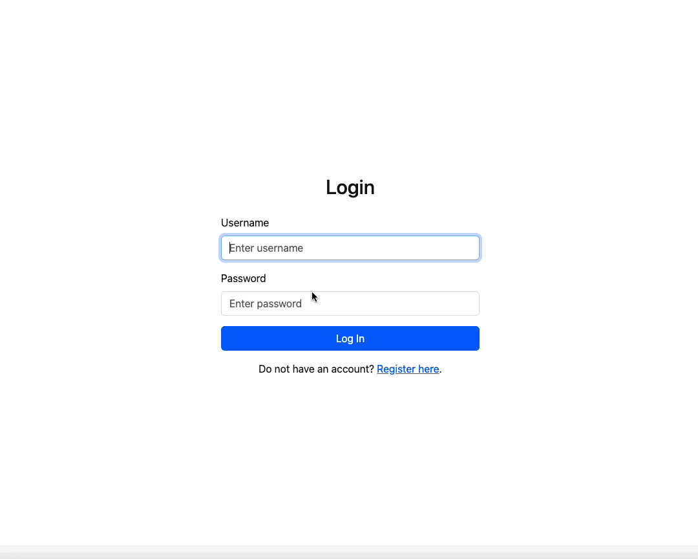

# Chateq

Chateq is a real-time communication application designed to facilitate instant messaging between users.
It supports text messages, includes features for message history, and provides user authentication for secure access.
Users can create accounts, log in, and view past conversations.

## Running Application

### Requirements

- [.NET 8 SDK](https://dotnet.microsoft.com/en-us/download/dotnet/8.0)
- [Docker](https://www.docker.com/products/docker-desktop)
- running instance of the SQL Server

### Steps

1. Configure database connections and secrets:
    - [src/Chateq.API/appsettings.json](src/Chateq.API/appsettings.json)
    - [src/Chateq.AppHost/appsettings.json](src/Chateq.AppHost/appsettings.json)
    - [src/Chateq.MessageBroker/appsettings.json](src/Chateq.MessageBroker/appsettings.json)
2. Run Kafka container: `docker-compose -f docker/kafka.yml up`
3. Run application: `dotnet run --project src/Chateq.AppHost`
    - Swagger should be available on: [https://localhost:7146/swagger/index.html](https://localhost:7146/swagger/index.html)
    - Aspire dashboard should be available on: [https://localhost:17098/](https://localhost:17098)
4. Run client: `cd client && npm run dev`
    - application should be available on [http://localhost:5173](http://localhost:5173)
